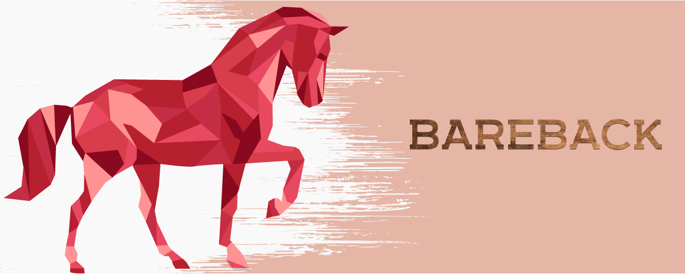

# Bareback

Bareback is a Laravel package that makes it easy to selectively choose which tests run with the framework loaded.

### Why would I want to run tests without the framework?

Running tests without loading the Laravel framework is much faster, typically anywhere from 50% to 70% faster.

It's often a good idea to try and implement core business logic with as little dependencies as possible. However, creating a whole 
application with no framework dependencies isn't practical or pragmatic. This package allows you to switch off the framework
when you're able to get away with it, and switch it on when it's convenient to do so.

## Installation

```
composer require "spacegrass/bareback=0.1"
```

## Usage
First you need to extend the base TestCase, which in turn extends the Laravel TestCase:

```
class TestCase extends \Spacegrass\Bareback\TestCase 
{

}
``` 

To stop the framework from loading, simply add the `@withoutFramework` annotation to your test method:
```
/**
* @withoutFramework
*/
public function test_something_quickly()
{

}
```

or alternatively, add the annotation to the class itself, and every test method therein will not load the framework by default. 
If you would like to turn on the framework, add the `@withFramework` annotation to any test method, and it that test method alone
will load the framework.
```
/**
* @withoutFramework
*/
class FastTests extends TestCase 
{
    
    public function test_something_without_framework_by_default()
    {
    
    }
    
    /**
    * @withFramework
    */
    public function test_something_with_the_framework_for_some_reason()
    {
    
    }
}
```
